<!-- capsule-banner:start -->

  

<!-- capsule-banner:end -->

<!-- contact-badges:start -->

  
  

<!-- contact-badges:end -->

  <strong>Computer Science · Software Development · Cybersecurity</strong>

  

---

## A little about me

I'm a computer science student interested in building useful software,
understanding how systems work, and exploring cybersecurity and AI.

I learn by working on projects, experimenting, and figuring things out
along the way.

<!-- tools-stack:start -->
## Tools, Platforms & Technologies

Tools and technologies from my projects, coursework and hands-on lab experiments.

### Languages

  

### Frontend & Backend

  

 

### Databases & Database Management

  

### Servers, Hosting & Domains

 

### Payments & Integrations

 

Stripe integration exercised in test mode. Tools shown cover different projects and environments.

<strong>Show development, testing and security-lab tools</strong>

### Development, Build & AI Tools

  

### Operating Systems & Environments

  

### Testing & Code Quality

  

 

### Security & Graduation-Project Lab

  

 

CodeCureAgent and Aider were trialled; their AI repair runs were not completed.

<!-- tools-stack:end -->

## What interests me

- Building practical applications and websites.
- Finding and fixing security issues in software.
- Exploring how AI can improve software development.

---

  <em>Learn it. Build it. Improve it.</em>

<!-- profile-stats:start -->

## GitHub Snapshot 📊

  <picture>
    <source
      media="(prefers-color-scheme: dark)"
      srcset="./profile-stats/stats-dark.svg"
    />
    
  </picture>
  <picture>
    <source
      media="(prefers-color-scheme: dark)"
      srcset="./profile-stats/languages-dark.svg"
    />
    
  </picture>

<!-- profile-stats:end -->

<!-- weekday-streak:start -->
## Contribution Streak 🔥

<picture>
  <source media="(prefers-color-scheme: dark)" srcset="./profile-extras/streak-dark.svg" />
  
</picture>

Saturday and Sunday are excluded from the streak calculation.
<!-- weekday-streak:end -->

<!-- snake-animation:start -->

## Contribution Snake 🐍

<picture>
  <source
    media="(prefers-color-scheme: dark)"
    srcset="https://raw.githubusercontent.com/zuhairhalawa/zuhairhalawa/snake-output/github-snake-dark.svg?v=2"
  />
  <source
    media="(prefers-color-scheme: light)"
    srcset="https://raw.githubusercontent.com/zuhairhalawa/zuhairhalawa/snake-output/github-snake.svg?v=2"
  />
  
</picture>

<!-- snake-animation:end -->

<!-- pacman-arcade:start -->
## Arcade Corner 👾

Show Pac-Man contribution animation

 

<picture>
  <source media="(prefers-color-scheme: dark)" srcset="./profile-extras/pacman-dark.svg" />
  
</picture>

<!-- pacman-arcade:end -->
